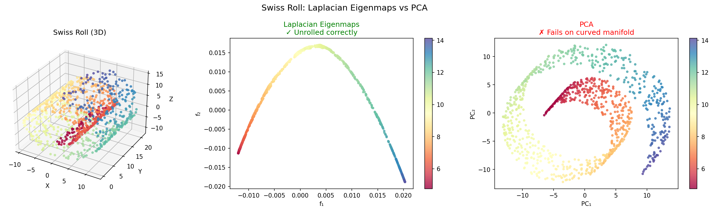
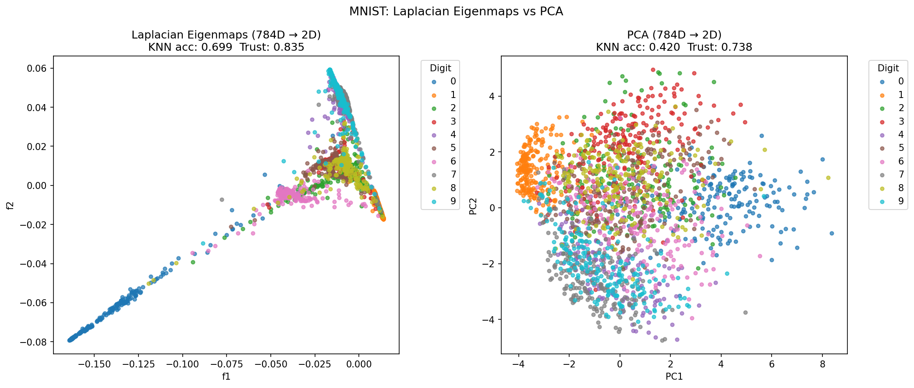
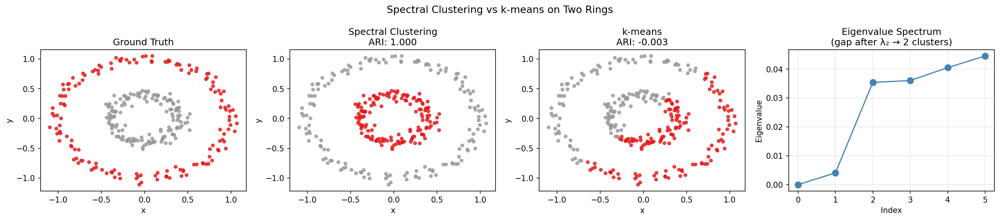

# Laplacian Eigenmaps

From-scratch implementation of **Belkin & Niyogi (2003)** — Laplacian Eigenmaps for Dimensionality Reduction and Data Representation.

No sklearn manifold methods used. Every step implemented directly from the paper using NumPy and SciPy.

## The Algorithm

Three steps:

**Step 1 — Build neighborhood graph**
Connect each point to its k nearest neighbors using KDTree.

**Step 2 — Compute Graph Laplacian**
Assign heat kernel weights to edges:
```
Wij = exp(-||xi - xj||² / t)
```
Compute L = D - W where D is the diagonal degree matrix.

**Step 3 — Solve generalized eigenvalue problem**
```
L f = λ D f
```
The eigenvectors f1, f2, ..., fm give the low-dimensional embedding.
This solves the optimization problem:
```
min  Σij Wij(fi - fj)²
s.t. f^T D f = 1
```

---

## Why It Works

The graph Laplacian L is a discrete approximation of the
Laplace-Beltrami operator on the data manifold.
Solving Lf = λDf recovers the natural coordinate functions
of the manifold — the eigenfunctions of the Laplace-Beltrami operator.

---

## Project Structure

```
core/
    graph.py        Step 1 — kNN graph
    laplacian.py    Step 2 — weights + L = D - W
    embedding.py    Step 3 — solve Lf = λDf

experiments/
    swiss_roll.py   Experiment 1 — manifold unrolling
    mnist.py        Experiment 2 — 784D to 2D reduction
    clustering.py   Experiment 3 — spectral clustering

results/            saved figures
```

---

## Setup

```bash
git clone https://github.com/yourusername/laplacian-eigenmaps
cd laplacian-eigenmaps

conda create -n laplacian-env python=3.9
conda activate laplacian-env

conda install numpy scipy matplotlib scikit-learn pandas
```

---

## Run Experiments

```bash
python -m experiments.swiss_roll
python -m experiments.mnist
python -m experiments.clustering
```

---

## Results

### Experiment 1 — Swiss Roll

Laplacian Eigenmaps correctly unrolls the 2D manifold from 3D space.
PCA fails because it cannot handle curvature.



---

### Experiment 2 — MNIST (784D → 2D)

| Metric | Laplacian Eigenmaps | PCA |
|---|---|---|
| KNN Accuracy | **0.699** | 0.420 |
| Trustworthiness | **0.835** | 0.731 |

Laplacian Eigenmaps achieves 66% higher KNN accuracy than PCA.



---

### Experiment 3 — Spectral Clustering

Same Laplacian machinery clusters non-convex shapes that k-means fails on.

| Method | Adjusted Rand Index |
|---|---|
| Spectral Clustering | **1.000** |
| k-means | -0.003 |

ARI = 1.0 means perfect cluster recovery.



---

## Key Insight

Dimensionality reduction and spectral clustering solve the same eigenvalue problem.
The difference is only in what you do with the eigenvectors:

- **Laplacian Eigenmaps** — use eigenvectors directly as new coordinates
- **Spectral Clustering** — run k-means on the eigenvectors

---

## Reference

Belkin, M., & Niyogi, P. (2003).
*Laplacian Eigenmaps for Dimensionality Reduction and Data Representation.*
Neural Computation, 15(6), 1373-1396.
```
# Laplacian-Eigenmaps-for-Dimensionality-Reduction-
